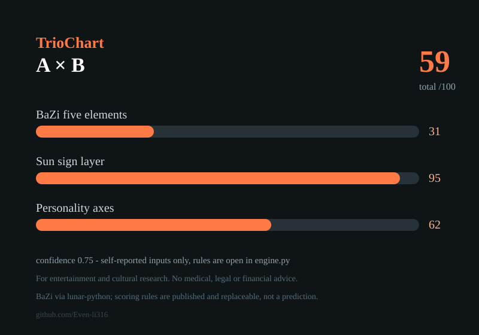

# TrioChart

**One relationship chart from three independent systems — BaZi (four pillars), sun sign, and self-reported personality — with every scoring rule published in code.**

<p align="center"></p>

Most compatibility tools are a black box that picks one system and hides the arithmetic.
TrioChart does the opposite:

- **three channels, one chart** — Chinese four-pillar five-elements overlap & mutual supply, Western element/modality pairing, personality axes (MBTI, optional Big Five);
- **every weight is in the source** — `trio_chart/engine.py` and `persona.py` hold plain rule tables you can read, argue with, and replace;
- **one honesty number** — the report carries a `confidence` value that drops when inputs are missing (no birth hour, no personality answers), because a chart cannot know more than its inputs.

## Demo

| | A | B |
|---|---|---|
| birth | 1990-05-03 08:30 | 1992-11-08 21:15 |
| MBTI | INFP | ENTJ |

```
five-element overlap 0.32, mutual supply a->b 0.35 b->a 0.25
day masters 戊 vs 戊      sun signs 双鱼(water) vs 双鱼(water)
persona: E/I differs, T/F differs, J/P differs -> negotiation, not intuition
```

## Quickstart

```bash
pip install -r requirements.txt          # lunar-python only
python -m trio_chart --a samples/a.json --b samples/b.json \
       --svg out.svg --json out.json
```

Input is deliberately boring JSON — no account, no upload, no telemetry:

```json
{"name": "A", "birth": "1990-05-03 08:30", "mbti": "INFP", "big5": {"O": 5, "C": 3, "E": 2, "A": 4, "N": 3}}
```

## What it is not

- **Not a prediction.** It is a structured, auditable way to lay out what each system says about two people — a conversation tool, not an oracle.
- **Not medical, legal or financial advice.** No health, fertility or diagnosis claims of any kind.
- **Not a verdict.** Only self-reported inputs go in, so `confidence` is capped and printed on the chart.

The scoring channels are intentionally separable: if you think the personality layer should weigh more, change one dict and re-run.

## Roadmap

- [ ] full natal chart layer (planets, aspects) — not only the sun sign
- [ ] Zi Wei Dou Shu channel (`iztro`-compatible input)
- [ ] shareable single-file HTML report
- [ ] bring-your-own-rules plugin interface

## 中文说明

三合一合盘：八字五行（四柱、藏干、纳音，基于 lunar-python）＋ 星座四象（元素、三分类）＋ 人格轴（MBTI，可选大五），
输出一张图和一份 JSON 报告。**打分规则全部写在代码里**，可以看、可以改、可以替换；报告带一个置信度数字，
输入缺项（没有时辰、没填人格）时会自动降低。仅供娱乐与文化研究，不做任何预测、医疗或投资建议。

## License

MIT — take the rules, replace them, ship something better.
